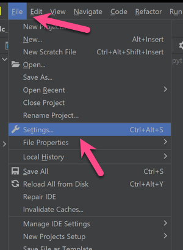
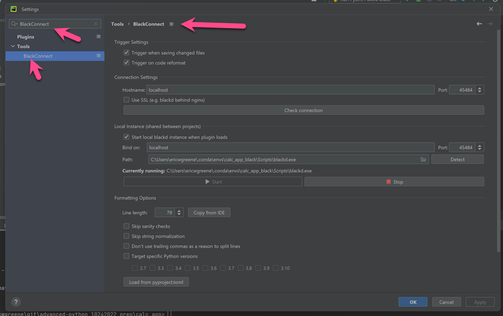

# PyCharm Linter and Formatter Configuration Notes

## Overview

Here is a list of links to review how to configure various linters and formatters.

- Pylint: [https://www.jetbrains.com/help/pycharm/configuring-third-party-tools.html](https://www.jetbrains.com/help/pycharm/configuring-third-party-tools.html)
- PyCodeStyle: [https://pypi.org/project/pycodestyle/](https://pypi.org/project/pycodestyle/)
- Autopep8: [https://github.com/hscgavin/autopep8-on-pycharm](https://github.com/hscgavin/autopep8-on-pycharm)
- Flake8: [https://www.singularaspect.com/flake8-and-pycharm/](https://www.singularaspect.com/flake8-and-pycharm/)
- PyFlakes: [https://pypi.org/project/pyflakes/](https://pypi.org/project/pyflakes/)
- Black: [https://black.readthedocs.io/en/stable/getting_started.html](https://black.readthedocs.io/en/stable/getting_started.html)

# PyCharm 

PyCharm from JetBrains is a popular Python code editor. It has numerous built-in code linting, formatting, and refactoring tools. Unfortunately, these tools are specific to PyCharm. For environments where each programmer uses the editor of their own choice, it is preferred to use external linting and formatting tools so that similar configurations can be shared across programmers while allowing them to use their editor of choice. These external linting and formatting tools are distributed as Python packages and such tools can be configured to work for all editors not just PyCharm. Unfortunately, PyCharm does not provide support for easily integrating these external linting formatting tools. Therefore, a little extra work is required to get them up and running.

PyCharm enables the programmers to use these external linters and formatters through the configuration of external tools and plugins. When configured as an external tool, the linter or formatter will be executed when the program is executed. Tools configured with a plugin will generally run when saving a file.

# Linters and Formatters

There are many linters and formatters to choose from in the Python programming world. For this help file, two linters and one formatter will be highlighted.

- [PyLint](https://pylint.pycqa.org/en/latest/) - provides code linting, one of the most popular choices
- [Flake8](https://flake8.pycqa.org/en/latest/) - another popular code linter
- [Black](https://github.com/psf/black) - opinionated code formatter

Both PyLint and Flake8 will be configured as external tools and Black will be configured with [BlackConnect](https://plugins.jetbrains.com/plugin/14321-blackconnect) PyCharm plugin. Generally, using plugins is preferred to external tools, but knowing how to configure external tools and integrate their usage into a Python project is a good skill to have.

# Configure PyCharm

The following instructions assume familiarity with PyCharm for configuring and running Python projects in general.

## Installing Packages


Before configuring any editor for these linting and formatting tools, the packages for them need to be installed.

Within the desired Conda environment, run the following Conda `install` command.

```bash
conda install pylint flake8 blackd
```

  Note: the usual Python package for Black is named `black`. But for the PyCharm pluging the `blackd` package needs to be installed.

## Configure External Tools

1. External Tools are configured under `Settings`.



2. Search for "External Tools" in the `Settings` search box.


  Note: In the picture above you will see a number of previously configured external tools. Your list will be empty unless you have explicitly added external tools in the past.

3. Click the "plus" icon to add a new external tool.


4. Add a new tool named "pylint" configured as shown below. Update your file paths for your machine.


5. Add a new tool named "flake8" configured as shown below. Update your file paths for your machine.


## Configure BlackConnect Plugin

6. From the `Settings`, find the `Plugins` tool, search for "BlackConnect" and install the plugin.


7. Find the `BlackConnect` configuration panel in settings, and configure `BlackConnect` for your Conda environment.



## Setup Run Configuration

8. Update the run configuration for your Python project to use the external tools when running the project.


  Note: You run configuration will most likely have no external tools configued. In this step, you will need to add them.

9. To add a new external tool, click the "+" button and select "Run external tool".


10. Select the desired external tool. Repeat for PyLint and Flake8.


11. You are all set. The configured linting and formatting tools will check your code when you run the project.


